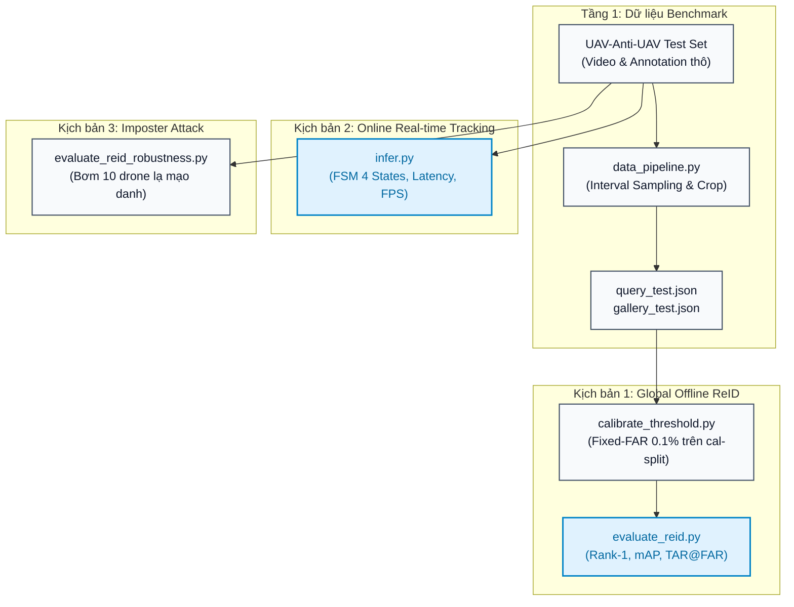
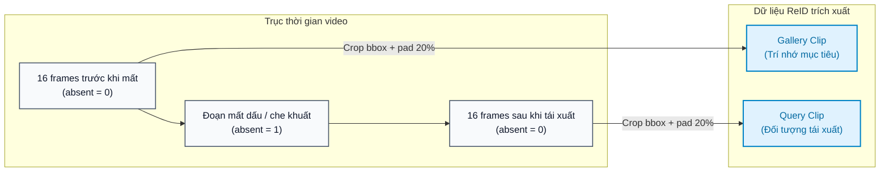
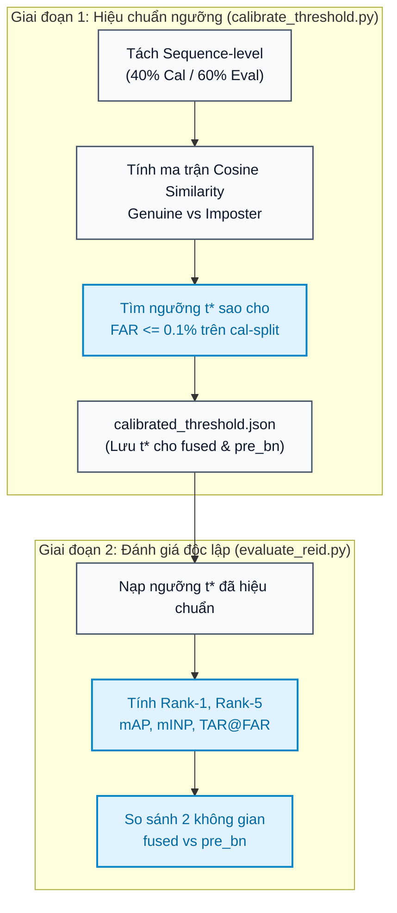
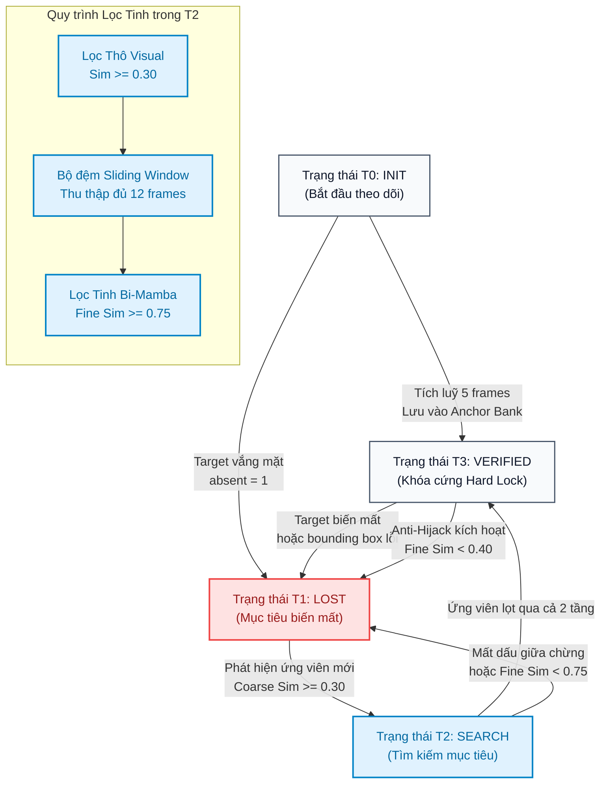
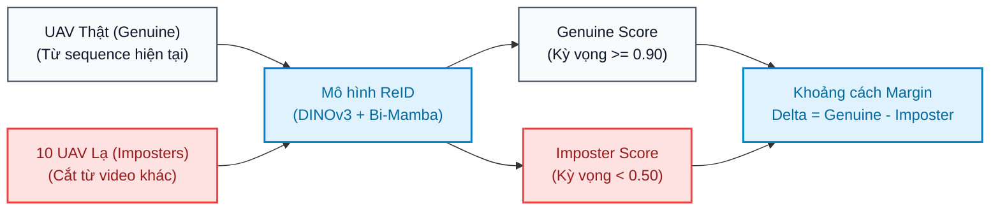

# BÁO CÁO CHI TIẾT: CÁC KỊCH BẢN ĐÁNH GIÁ MÔ HÌNH UAV-ANTI-UAV REID

Tài liệu này tổng hợp và trực quan hóa toàn bộ các kịch bản đánh giá, cấu trúc dữ liệu thử nghiệm, quy chuẩn thuật toán và bài học thực nghiệm của mô hình **UAV-Anti-UAV ReID** (**DINOv3 ConvNeXt-Small + Bi-Mamba S6 + BNNeck**).

---

## 1. TỔNG QUAN HỆ THỐNG ĐÁNH GIÁ

Toàn bộ hệ thống đánh giá mô hình được chia thành **3 kịch bản độc lập nhưng bổ trợ lẫn nhau**:


<details>
<summary>📋 Bấm để xem / sao chép mã nguồn Mermaid thô</summary>

```text
flowchart TD
    classDef step fill:#f8fafc,stroke:#475569,stroke-width:1.5px,color:#0f172a
    classDef highlight fill:#e0f2fe,stroke:#0284c7,stroke-width:2px,color:#0369a1
    classDef container fill:#f1f5f9,stroke:#94a3b8,stroke-width:1.5px,color:#0f172a

    subgraph DATA_TIER ["Tầng 1: Dữ liệu Benchmark"]
        direction TB
        RAW_TEST["UAV-Anti-UAV Test Set<br/>(Video & Annotation thô)"]:::step
        DP_EXEC["data_pipeline.py<br/>(Interval Sampling & Crop)"]:::step
        RAW_TEST --> DP_EXEC
        DP_EXEC --> PROC_META["query_test.json<br/>gallery_test.json"]:::step
    end

    subgraph SCENARIO_1 ["Kịch bản 1: Global Offline ReID"]
        direction TB
        PROC_META --> CALIB["calibrate_threshold.py<br/>(Fixed-FAR 0.1% trên cal-split)"]:::step
        CALIB --> EVAL["evaluate_reid.py<br/>(Rank-1, mAP, TAR@FAR)"]:::highlight
    end

    subgraph SCENARIO_2 ["Kịch bản 2: Online Real-time Tracking"]
        direction TB
        RAW_TEST --> INFER["infer.py<br/>(FSM 4 States, Latency, FPS)"]:::highlight
    end

    subgraph SCENARIO_3 ["Kịch bản 3: Imposter Attack"]
        direction TB
        RAW_TEST --> ROBUST["evaluate_reid_robustness.py<br/>(Bơm 10 drone lạ mạo danh)"]:::step
    end
```
</details>

---

## 2. CẤU TRÚC DỮ LIỆU ĐƯỢC ĐÁNH GIÁ

### 2.1. Tập dữ liệu thô (Raw Benchmark Test Set)
Mô hình được đánh giá trên tập **`Test`** của benchmark `UAV-Anti-UAV`, đặc biệt tập trung vào các sequence chứa sự kiện đối tượng bay khuất bóng (`absent.txt` chứa nhãn `1`).

```text
UAV-Anti-UAV/
└── Test/
    ├── UAV-Anti-UAV_Test_000001/
    │   ├── UAV-Anti-UAV_Test_000001.mp4   # Video ghi hình độ phân giải 1080p/720p
    │   ├── groundtruth_rect.txt           # Toạ độ Bounding Box [x, y, w, h] theo frame
    │   ├── absent.txt                     # Nhãn nhị phân (0: có mặt, 1: biến mất)
    │   ├── attributes.txt                 # 15 thuộc tính thách thức (Occlusion, Fast Motion...)
    │   └── language.txt                   # Mô tả ngôn ngữ tự nhiên
    ├── ...
    └── UAV-Anti-UAV_Test_000059/          # Sequence mẫu tiêu chuẩn để benchmark sâu
```

### 2.2. Quy trình trích xuất và Cấu trúc dữ liệu ReID (Processed Crops)
Script `data_pipeline.py` quét qua từng sequence trong tập Test, xác định các điểm giao thoa khi mục tiêu biến mất rồi tái xuất để tạo thành các cặp **(Gallery, Query)**:


<details>
<summary>📋 Bấm để xem / sao chép mã nguồn Mermaid thô</summary>

```text
flowchart LR
    classDef video fill:#f8fafc,stroke:#475569,stroke-width:1.5px,color:#0f172a
    classDef crop fill:#e0f2fe,stroke:#0284c7,stroke-width:2px,color:#0369a1

    subgraph TIME_AXIS ["Trục thời gian video"]
        direction LR
        F_BEFORE["16 frames trước khi mất<br/>(absent = 0)"]:::video
        F_LOST["Đoạn mất dấu / che khuất<br/>(absent = 1)"]:::video
        F_AFTER["16 frames sau khi tái xuất<br/>(absent = 0)"]:::video
        F_BEFORE --> F_LOST --> F_AFTER
    end

    subgraph CROP_OUT ["Dữ liệu ReID trích xuất"]
        direction TB
        F_BEFORE -->|Crop bbox + pad 20%| GAL["Gallery Clip<br/>(Trí nhớ mục tiêu)"]:::crop
        F_AFTER -->|Crop bbox + pad 20%| QUE["Query Clip<br/>(Đối tượng tái xuất)"]:::crop
    end
```
</details>

Thư mục lưu trữ sau trích xuất:
```text
processed/
├── test/
│   ├── UAV-Anti-UAV_Test_000059_event_0/
│   │   ├── before/         # Chứa 16 ảnh crop Gallery (trước khi mất)
│   │   └── after/          # Chứa 16 ảnh crop Query (sau khi tái xuất)
│   └── ...
├── query_test.json         # Danh sách metadata truy vấn Test
└── gallery_test.json       # Danh sách metadata kho lưu trữ Test
```

---

## 3. KỊCH BẢN 1: ĐÁNH GIÁ OFFLINE REID TOÀN CỤC (GLOBAL RETRIEVAL & VERIFICATION)

### 3.1. Mục đích
Đánh giá độ chính xác phân biệt định danh (ID separability) của mô hình trên toàn bộ tập dữ liệu, mô phỏng bài toán: Khi một UAV tái xuất hiện, giữa một kho Gallery gồm hàng trăm UAV khác nhau, mô hình có thể truy xuất và xác nhận đúng danh tính hay không.

### 3.2. Sơ đồ quy trình 2 giai đoạn (Fixed-FAR Calibration & Evaluation)


<details>
<summary>📋 Bấm để xem / sao chép mã nguồn Mermaid thô</summary>

```text
flowchart TD
    classDef norm fill:#f8fafc,stroke:#475569,stroke-width:1.5px,color:#0f172a
    classDef focus fill:#e0f2fe,stroke:#0284c7,stroke-width:2px,color:#0369a1

    subgraph STAGE_CALIB ["Giai đoạn 1: Hiệu chuẩn ngưỡng (calibrate_threshold.py)"]
        direction TB
        SPLIT["Tách Sequence-level<br/>(40% Cal / 60% Eval)"]:::norm
        SIM_MAT["Tính ma trận Cosine Similarity<br/>Genuine vs Imposter"]:::norm
        FIND_T["Tìm ngưỡng t* sao cho<br/>FAR <= 0.1% trên cal-split"]:::focus
        REPORT_CAL["calibrated_threshold.json<br/>(Lưu t* cho fused & pre_bn)"]:::norm
        SPLIT --> SIM_MAT --> FIND_T --> REPORT_CAL
    end

    subgraph STAGE_EVAL ["Giai đoạn 2: Đánh giá độc lập (evaluate_reid.py)"]
        direction TB
        LOAD_T["Nạp ngưỡng t* đã hiệu chuẩn"]:::norm
        COMPUTE_M["Tính Rank-1, Rank-5<br/>mAP, mINP, TAR@FAR"]:::focus
        COMPARE_SPACES["So sánh 2 không gian<br/>fused vs pre_bn"]:::focus
        LOAD_T --> COMPUTE_M --> COMPARE_SPACES
    end

    REPORT_CAL --> LOAD_T
```
</details>

### 3.3. Đối chứng hai không gian đặc trưng (Feature Spaces)
Để xác minh BatchNorm1d trong `ReIDHead` có phá hỏng độ phân biệt hay không, script đánh giá chạy đồng thời trên 2 không gian:
1. **Không gian `pre_bn` (Vector thô):**
   $$
   \mathbf{f}_{\text{raw}} = \left[ \mathbf{f}_{\text{visual}} \parallel \mathbf{f}_{\text{temporal}} \right] \in \mathbb{R}^{1472}
   $$
   Sau đó chuẩn hóa L2 trước khi tính Cosine similarity.
2. **Không gian `fused` (Vector sau BNNeck):**
   $$
   \mathbf{f}_{\text{fused}} = \text{BatchNorm1d}(\mathbf{f}_{\text{raw}})
   $$
   Sau đó chuẩn hóa L2 trước khi tính Cosine similarity.

### 3.4. Các chỉ số đo đạc cốt lõi
- **Rank-1 / Rank-5 (%):** Tỷ lệ mẫu Query tìm thấy đúng ID thật của mình ở vị trí xếp hạng thứ 1 hoặc trong top 5 ứng viên tương đồng nhất.
- **mAP (Mean Average Precision):** Độ chính xác trung bình trên toàn bộ danh sách truy xuất.
- **mINP (Mean Inverse Negative Penalty):** Đo lường chi phí truy xuất để tìm ra mẫu đúng cuối cùng.
- **TAR@FAR=0.1% (True Accept Rate tại FAR 0.1%):** Tỷ lệ chấp nhận đúng mục tiêu khi giới hạn tỷ lệ nhận nhầm kẻ mạo danh không vượt quá 1 trên 1000 lượt.

---

## 4. KỊCH BẢN 2: MÔ PHỎNG BÁM BẮT THỜI GIAN THỰC (ONLINE SEQUENTIAL TRACKING FSM)

### 4.1. Mục đích
Mô phỏng quy trình hoạt động của hệ thống theo dõi trực tiếp trên camera/đầu thu video độ phân giải cao, quản lý bộ nhớ dài hạn/ngắn hạn và khóa lại mục tiêu qua máy trạng thái 4 pha.

### 4.2. Sơ đồ máy trạng thái FSM 4 pha (Pipeline State Machine)


<details>
<summary>📋 Bấm để xem / sao chép mã nguồn Mermaid thô</summary>

```text
flowchart TD
    classDef state fill:#f8fafc,stroke:#475569,stroke-width:1.5px,color:#0f172a
    classDef process fill:#e0f2fe,stroke:#0284c7,stroke-width:2px,color:#0369a1
    classDef alert fill:#fee2e2,stroke:#ef4444,stroke-width:2px,color:#991b1b

    T0["Trạng thái T0: INIT<br/>(Bắt đầu theo dõi)"]:::state
    T1["Trạng thái T1: LOST<br/>(Mục tiêu biến mất)"]:::alert
    T2["Trạng thái T2: SEARCH<br/>(Tìm kiếm mục tiêu)"]:::process
    T3["Trạng thái T3: VERIFIED<br/>(Khóa cứng Hard Lock)"]:::state

    T0 -->|Tích luỹ 5 frames<br/>Lưu vào Anchor Bank| T3
    T0 -->|Target vắng mặt<br/>absent = 1| T1

    T3 -->|Target biến mất<br/>hoặc bounding box lỗi| T1
    T3 -->|Anti-Hijack kích hoạt<br/>Fine Sim < 0.40| T1

    T1 -->|Phát hiện ứng viên mới<br/>Coarse Sim >= 0.30| T2

    subgraph COARSE_FINE_FILTER ["Quy trình Lọc Tinh trong T2"]
        direction TB
        F1["Lọc Thô Visual<br/>Sim >= 0.30"]:::process
        F2["Bộ đệm Sliding Window<br/>Thu thập đủ 12 frames"]:::process
        F3["Lọc Tinh Bi-Mamba<br/>Fine Sim >= 0.75"]:::process
        F1 --> F2 --> F3
    end

    T2 -->|Ứng viên lọt qua cả 2 tầng| T3
    T2 -->|Mất dấu giữa chừng<br/>hoặc Fine Sim < 0.75| T1
```
</details>

### 4.3. Các cơ chế công nghệ cốt lõi trong Online Inference
1. **Two-Tier Memory Bank:**
   - **Anchor Bank (Ký ức nguyên thủy):** Lưu tối đa 5 đặc trưng chất lượng cao nhất tại thời điểm bắt đầu (`T0_INIT`). Đây là "kim chỉ nam" bất biến chống lại hiện tượng trôi dạt đặc trưng (feature drift).
   - **Recent Bank (Ký ức ngắn hạn):** Lưu tối đa 15 đặc trưng gần nhất theo hàng đợi FIFO, cập nhật mỗi chu kỳ 2s để thích nghi với sự thay đổi góc nhìn và ánh sáng.
2. **Cơ chế chống cướp mục tiêu (Anti-Hijack):**
   - Trong 5 lần cập nhật bộ nhớ đầu tiên sau khi khóa lại (`T3_VERIFIED`), hệ thống liên tục so sánh đặc trưng hiện tại với `Anchor Bank`. Nếu độ tương đồng $< 0.40$, hệ thống xác định đã bám nhầm chim mồi (distractor) và ngay lập tức hủy khóa, chuyển về trạng thái `T1_LOST`.
3. **Chỉ số đo đạc vận hành thực tế:**
   - **Avg CNN Extraction Time (ms):** Tốc độ trích xuất đặc trưng không gian.
   - **Avg Mamba + Head Time (ms):** Tốc độ xử lý chuỗi thời gian.
   - **Throughput (FPS):** Tốc độ tổng thể toàn bộ pipeline.
   - **Re-acquisition Latency (frames):** Số lượng frames từ khi drone tái xuất đến khi khóa cứng lại.
   - **False Alarms (Fine Fails):** Số lần bộ lọc tinh bác bỏ ứng viên rác.

---

## 5. KỊCH BẢN 3: ĐÁNH GIÁ TÍNH KHÁNG NHIỄU (IMPOSTER ATTACK TEST)

### 5.1. Mục đích
Đo lường năng lực của bộ lọc tinh Bi-Mamba trong tình huống không phận xuất hiện đồng thời nhiều UAV lạ (chim mồi hoặc phương tiện bay khác) tìm cách gây nhiễu và cướp track.


<details>
<summary>📋 Bấm để xem / sao chép mã nguồn Mermaid thô</summary>

```text
flowchart LR
    classDef track fill:#f8fafc,stroke:#475569,stroke-width:1.5px,color:#0f172a
    classDef imposter fill:#fee2e2,stroke:#ef4444,stroke-width:2px,color:#991b1b
    classDef head fill:#e0f2fe,stroke:#0284c7,stroke-width:2px,color:#0369a1

    GEN["UAV Thật (Genuine)<br/>(Từ sequence hiện tại)"]:::track --> REID["Mô hình ReID<br/>(DINOv3 + Bi-Mamba)"]:::head
    IMP["10 UAV Lạ (Imposters)<br/>(Cắt từ video khác)"]:::imposter --> REID

    REID --> SCORE_GEN["Genuine Score<br/>(Kỳ vọng >= 0.90)"]:::track
    REID --> SCORE_IMP["Imposter Score<br/>(Kỳ vọng < 0.50)"]:::imposter

    SCORE_GEN & SCORE_IMP --> MARGIN["Khoảng cách Margin<br/>Delta = Genuine - Imposter"]:::head
```
</details>

### 5.2. Các chỉ số đo đạc
- **Average Genuine Similarity:** Điểm tương đồng trung bình của mục tiêu thật (cần sát 1.0).
- **Average Imposter Similarity:** Điểm tương đồng của UAV lạ (càng thấp càng an toàn, lý tưởng $< 0.50$).
- **Separation Margin:** Độ chênh lệch giữa điểm thật và điểm giả ($\text{Margin} = \text{Sim}_{\text{gen}} - \text{Sim}_{\text{imp}}$).
- **False Rejection Rate (FRR %):** Tỷ lệ từ chối nhầm UAV thật.
- **False Acceptance Rate (FAR %):** Tỷ lệ chấp nhận nhầm UAV giả.

---

## 6. CÁC PHÁT HIỆN THỰC NGHIỆM VÀ KINH NGHIỆM TỐI QUAN TRỌNG (14/9 & 15/9)

| Hiện tượng thực tế | Nguyên nhân gốc rễ | Giải pháp đã khắc phục |
| :--- | :--- | :--- |
| **Temporal score dao động mạnh (0.47 - 0.74)** | Lệch độ dài token: `train.num_frames = 12` nhưng config infer cũ để `num_frames = 8`. | Đồng bộ tuyệt đối `num_frames: 12` trên toàn bộ các file config. Temporal score tăng vọt lên **0.938**. |
| **Fine score bị nén xuống quanh 0.73** | `BatchNorm1d` trong `ReIDHead` nén khoảng cách cosine một cách có hệ thống khoảng 0.218. | Chạy song song cả 2 không gian `pre_bn` và `fused`. Hiệu chuẩn ngưỡng $t^*$ riêng cho từng không gian. |
| **4/8 ca tái xuất không thể khóa lại** | UAV tái xuất quá ngắn (chỉ 6 - 10 frames), bộ đệm sliding window không thu đủ 12 frames liên tục. | Thiết kế cơ chế resample/padding cho các chuỗi ngắn thay vì loại bỏ. |
| **Trọng số compile và backbone** | `torch.compile` thêm tiền tố `_orig_mod.` khiến việc load checkpoint thông thường bỏ qua 854 keys backbone. | Sử dụng [load_checkpoint_verbose()](file:///c:/Users/admin/Developer/ViettelDev/UAVAntiUAV/model.py#L219) để bóc tách prefix và báo cáo chi tiết từng key. |

---

## 7. CẤU HÌNH VÀ CÁC BƯỚC THỰC THI TRÊN KAGGLE

### 7.1. Các file đã thiết lập sẵn trong mã nguồn
- **File cấu hình:** [configs/config_kaggle.yaml](file:///c:/Users/admin/Developer/ViettelDev/UAVAntiUAV/configs/config_kaggle.yaml)
- **Script chạy điều phối:** [run_kaggle_eval.py](file:///c:/Users/admin/Developer/ViettelDev/UAVAntiUAV/run_kaggle_eval.py)
- **Notebook tương tác:** [notebooks/kaggle_uav_reid_evaluation.ipynb](file:///c:/Users/admin/Developer/ViettelDev/UAVAntiUAV/notebooks/kaggle_uav_reid_evaluation.ipynb)

### 7.2. Lệnh thực thi trực tiếp qua Terminal / Bash
```bash
# 1. Chạy toàn bộ các bước từ A đến Z:
python run_kaggle_eval.py --config configs/config_kaggle.yaml --mode all

# 2. Chỉ chạy Hiệu chuẩn ngưỡng & Đánh giá ReID toàn cục:
python run_kaggle_eval.py --config configs/config_kaggle.yaml --mode calib_eval

# 3. Chỉ chạy Mô phỏng Tracking trên video sequence 000001:
python run_kaggle_eval.py --config configs/config_kaggle.yaml --mode infer --seq UAV-Anti-UAV_Test_000001

# 4. Chỉ chạy Bài test Kháng nhiễu Imposters:
python run_kaggle_eval.py --config configs/config_kaggle.yaml --mode robustness
```
