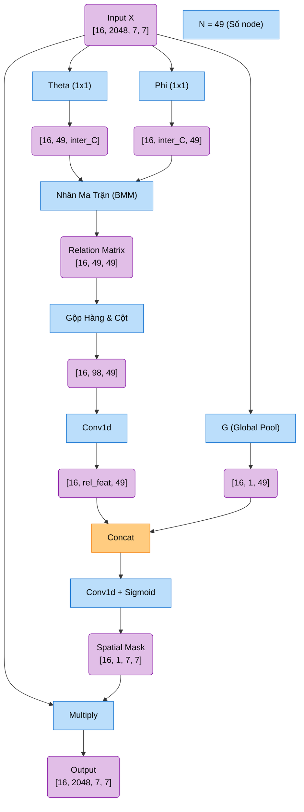
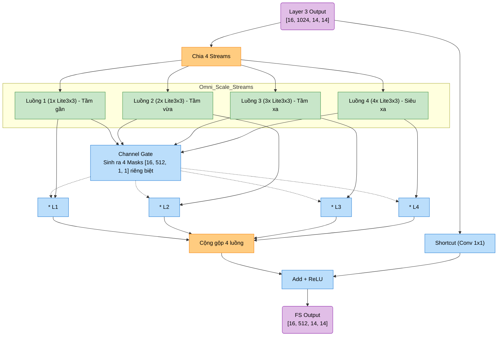
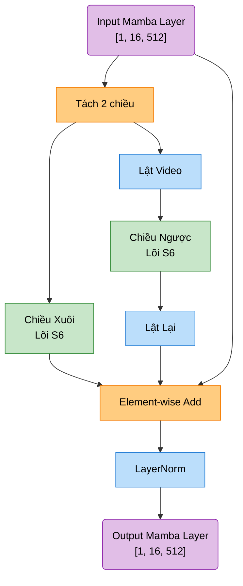
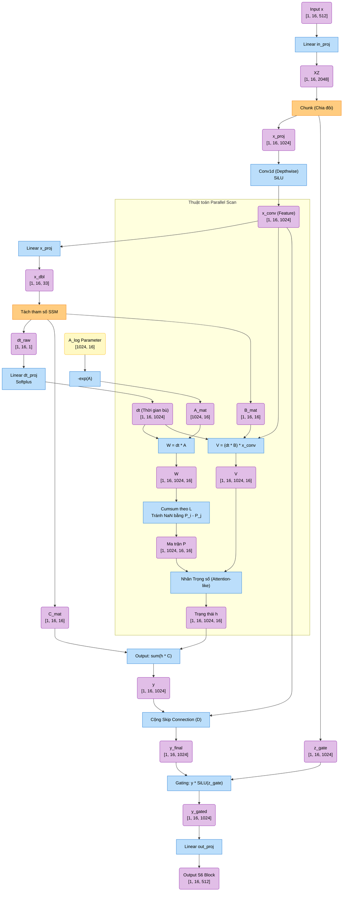

# KIẾN TRÚC LUỒNG MA TRẬN UAVReIDNet

Tài liệu này phân tích chi tiết biến đổi ma trận ở từng module của mạng nhận diện UAV (UAVReIDNet), bao gồm 3 trục chính: Hình ảnh (GASNet), Thời gian (Mamba), và Định danh (ReID Head).

**Khởi đầu:** Dữ liệu đầu vào là một batch video clip. 
- Giả sử Batch Size $B = 1$, Số lượng khung hình $N = 16$.
- Kích thước ảnh chuẩn: $224 \times 224$.
- Kích thước Tensor gốc: `[1, 16, 3, 224, 224]`.
- **Thao tác Fold:** Trước khi vào GASNet, hệ thống ép 2 trục $B$ và $N$ làm một để xử lý tĩnh. Tensor chuyển thành: **`[16, 3, 224, 224]`**.

---

## 1. TRỤC XƯƠNG SỐNG HÌNH ẢNH: GASNET (2D CNN)
Nhiệm vụ: Trích xuất đặc trưng không gian của UAV trên từng frame ảnh rời rạc.

### 1.1. Stem (Trạm tiếp đón)
*   **Phép toán:** Tích chập 7x7 (stride 2) $\rightarrow$ BatchNorm $\rightarrow$ ReLU $\rightarrow$ MaxPool 3x3 (stride 2).
*   **Biến đổi Ma trận:** `[16, 3, 224, 224]` $\rightarrow$ **`[16, 64, 56, 56]`**.
*   **Chi tiết:** Đóng vai trò như một "cái phễu" thu nhỏ khung hình siêu tốc. Giúp giảm tải đột ngột lượng tính toán (FLOPs) trước khi đưa vào các lớp mạng sâu, đồng thời trích xuất các đặc trưng viền/góc cơ bản.

### 1.2. ResNet50-IBN Backbone (Các lớp sâu)
*   **Layer 1 (Có IBN):** Dữ liệu chẻ làm đôi. 32 kênh đi qua Instance Norm (lọc bỏ nhiễu môi trường như độ sáng, màu mây), 32 kênh đi qua Batch Norm (giữ lại cấu trúc hình học của UAV).
    *   Ma trận: `[16, 64, 56, 56]` $\rightarrow$ **`[16, 256, 56, 56]`**.
*   **Layer 2 (Có IBN):** Bước nhảy (Stride = 2) làm giảm nửa kích thước không gian.
    *   Ma trận: `[16, 256, 56, 56]` $\rightarrow$ **`[16, 512, 28, 28]`**.
*   **Layer 3 (Có IBN):** Tiếp tục giảm nửa kích thước không gian.
    *   Ma trận: `[16, 512, 28, 28]` $\rightarrow$ **`[16, 1024, 14, 14]`**.
*   **Layer 4 (KHÔNG IBN):** 
    *   Ma trận: `[16, 1024, 14, 14]` $\rightarrow$ **`[16, 2048, 7, 7]`**.
    *   *Chi tiết:* Ở độ sâu này, ảnh chỉ còn $7 \times 7$. Mạng cố tình tắt IBN (chỉ dùng BN thuần túy) vì lúc này dữ liệu mang 100% ngữ nghĩa (Semantic) định danh ID. Nếu dùng Instance Norm ở đây sẽ vô tình "rửa trôi" mất đặc điểm ID cốt lõi của UAV.

### 1.3. Khối RGA (Relation-Aware Global Attention)
Được chèn vào sau mỗi Layer để tự động nhóm các điểm ảnh có liên kết cấu trúc lại với nhau. Dưới đây là kiến trúc của RGA Spatial (Áp dụng tại Layer 4, Ma trận vào `[16, 2048, 7, 7]`):

*(Cơ chế RGAChannel lặp lại tương tự nhưng dùng ma trận quan hệ `[2048, 2048]`).*

**Giải phẫu chi tiết cơ chế RGA:**
*   **Vấn đề:** Các cơ chế Attention cũ thường chỉ đoán vùng quan trọng dựa trên màu sắc cục bộ. Đối với UAV bay trên bầu trời, nhiễu (mây) rất dễ đánh lừa mô hình.
*   **Cách hoạt động:** RGA sinh ra Ma trận quan hệ $N \times N$ (ở đây là $49 \times 49$). Nó tính toán mức độ giống nhau của từng điểm ảnh với 48 điểm ảnh còn lại.
*   **Hiệu quả:** Mô hình học được "Sự liên kết bầy đàn". Dù UAV có mờ, nhưng mô hình phát hiện ra cấu trúc 4 cánh quạt có mối quan hệ hình học mật thiết với nhau, nó sẽ cấp hệ số Mask sáng rực cho toàn bộ 4 cánh quạt đó, đồng thời dập tắt hoàn toàn các điểm ảnh của bầu trời do chúng không có liên kết cấu trúc nào.

### 1.4. Nhánh Đa tỷ lệ Full Scale (OSBlockFS)
Rẽ nhánh từ Layer 3 để dò tìm UAV ở nhiều mức độ bao quát khác nhau (từ UAV bay sát camera đến UAV lẩn khuất ở xa).

**Giải phẫu chi tiết cơ chế Full Scale:**
*   **Khối Lite3x3 (Công nghệ Depthwise):** Để mô phỏng tầm nhìn xa $5 \times 5, 7 \times 7$, mạng xếp chồng nhiều khối $3 \times 3$ lên nhau. Để tránh nặng máy, Lite3x3 trượt bộ lọc $3 \times 3$ **độc lập trên từng kênh riêng biệt** (không trộn kênh), giúp giảm tới 90% số lượng phép tính (FLOPs) so với tích chập truyền thống.
*   **Cổng kiểm soát (Channel Gate):** Hoạt động như một bàn trộn âm thanh (Mixer). Nó được "Share" (dùng chung 1 bộ trọng số) cho cả 4 luồng. Khi nhận ảnh UAV nhỏ xíu, Gate sẽ tự động sinh ra một tấm Mask (Mặt nạ) toàn số 0 cho Luồng 1 (tắt luồng cận cảnh), và Mask toàn số 1 cho Luồng 4 (bật tối đa luồng siêu xa). Do đó, nhánh này đóng vai trò như một bộ **Auto-focus tự động bắt nét mọi kích cỡ**.

### 1.5. GeM Pooling (Generalized Mean Pooling)
*   **Cơ chế:** Kỹ thuật ép phẳng ảnh từ 2D về 1D. Nó áp dụng công thức Lũy thừa $p=3.0$ trước khi lấy trung bình, sau đó khai căn bậc $3$.
*   **Tác dụng:** Việc mũ $3$ giúp khuếch đại cực mạnh khoảng cách giữa điểm sáng (UAV) và điểm mờ (Nền trời). Nó là dạng lai hoàn hảo giữa Average Pool (giữ bối cảnh) và Max Pool (giữ đặc trưng nổi bật).
*   **Kết quả Ma trận:**
    *   Nhánh Global: `[16, 2048, 7, 7]` $\rightarrow$ GeM $\rightarrow$ Vector `[16, 2048]`.
    *   Nhánh FS: `[16, 512, 14, 14]` $\rightarrow$ GeM $\rightarrow$ Vector `[16, 512]`.
    *   Ghép nối (Concat): **`[16, 2560]`**.
    *   **Thao tác Unfold:** Mở bung ma trận trở lại định dạng Video $\rightarrow$ **`[1, 16, 2560]`**.

---

## 2. TRỤC NÃO BỘ CHUYỂN ĐỘNG: TEMPORAL MAMBA
Nhiệm vụ: Tìm kiếm quỹ đạo bay và mô hình chuyển động theo trục thời gian bằng công nghệ State Space Model (SSM).

### 2.1. Cấu trúc Bi-Mamba (Tầm nhìn 2 chiều)

**Giải phẫu chi tiết cơ chế Bi-Mamba:**
*   **Linear Projection & Positional Embedding:** Nén vector khổng lồ `2560` xuống `512` chiều để giảm tải RAM, đồng thời cộng thêm ma trận số thứ tự (tọa độ thời gian) để Mamba phân biệt được trật tự trước/sau của các frame ảnh.
*   **Phân tích Kép (Bidirectional):** Khi UAV bị che khuất ngang chừng (Occlusion), việc chỉ nhìn từ Quá khứ (Chiều xuôi) sẽ khiến mạng mất dấu. Bằng cách lấy thêm dữ liệu tua ngược từ Tương lai (Chiều ngược) và cộng gộp lại, mạng có khả năng **nội suy và vá lỗi quỹ đạo** cực kỳ mạnh mẽ.

### 2.2. Giải phẫu chi tiết Cấp độ Ma trận của khối SimpleS6Block (Selective Scan)
Đây là lõi toán học thay thế hoàn hảo cho Attention, giúp Mamba xử lý tuyến tính mà vẫn "chọn lọc" được ngữ cảnh. Giả định đầu vào `x` có kích thước **`[B=1, L=16, d_model=512]`** (1 video, 16 frames, 512 chiều), hệ số mở rộng `expand=2`, bộ nhớ `d_state=16`.
=> `d_inner = expand * d_model = 1024`.

**Biến đổi Ma trận chi tiết trong SimpleS6Block:**

*   **Bước 1: Mở rộng và Khởi tạo cục bộ (Linear & Local Conv)**
    *   Ma trận đầu vào `[1, 16, 512]` được nhân ma trận (Linear) bung ra thành `[1, 16, 2048]`, sau đó cắt làm 2 nửa độc lập: Nhánh đặc trưng `x_proj` `[1, 16, 1024]` và Nhánh cổng kiểm soát `z_gate` `[1, 16, 1024]`.
    *   `x_proj` đi qua tích chập 1D (Depthwise) để thu thập thông tin cục bộ giữa các frames lân cận, tạo ra `x_conv` **`[1, 16, 1024]`**.
*   **Bước 2: Sinh tham số động "Selective" (Tính chọn lọc)**
    *   Sự khác biệt lớn nhất giữa Mamba và SSM cũ là tham số không cố định. `x_conv` đi qua Linear để đẻ ra một ma trận siêu nhỏ `x_dbl` `[1, 16, 33]`.
    *   `33` chiều này được cắt nhỏ thành: `dt` (1 chiều), `B` (16 chiều, tức `d_state`), `C` (16 chiều). Do đó, $B$ và $C$ biến đổi linh hoạt theo từng Frame.
    *   Hệ số `dt` (bước nhảy thời gian) sau đó được giãn nở trở lại bằng Linear để phủ kín 1024 kênh $\rightarrow$ `dt` **`[1, 16, 1024]`**.
*   **Bước 3: Parallel Selective Scan (Attention-like Formulation)**
    *   Đây là phép thuật toán học của Mamba. Thay vì vòng lặp tuần tự $h_t = A * h_{t-1} + B * x_t$ rất chậm, đoạn code tính toán song song:
    *   Biến rời rạc hóa: `W = dt * A` và trọng số `V = (dt * B) * x_conv`. Chúng tạo ra các ma trận 4D khổng lồ lưu trữ toàn bộ trạng thái hệ thống: **`[1, 16, 1024, 16]`** (Batch, L, d_inner, d_state).
    *   Thuật toán tính toán ma trận tổng tích lũy (Cumsum) $P$ dọc theo chiều thời gian (L), sau đó lấy độ chênh lệch $(P_i - P_j)$. Trick toán học này để mô phỏng sự tích lũy của chuỗi thời gian mà không cần chạy vòng lặp, đồng thời tránh lỗi toán học NaN cực tốt.
    *   Áp dụng Causal Mask (Mặt nạ tam giác dưới) để đảm bảo Tương lai không ảnh hưởng đến Quá khứ.
    *   Hội tụ lại thu được bộ nhớ ẩn $h$ **`[1, 16, 1024, 16]`**.
*   **Bước 4: Hội tụ Đầu ra & Gating**
    *   Trạng thái $h$ nhân với hệ số quyết định $C$ rồi tính tổng (sum) dọc theo chiều `d_state` để nén lại thành `y` **`[1, 16, 1024]`**.
    *   Cơ chế Gating: `y` được nhân phần tử (element-wise) với `SiLU(z_gate)`. Nhánh Gating đóng vai trò như một bộ lọc nhiễu, dập tắt các tín hiệu nhiễu từ bối cảnh và giữ lại luồng thông tin chứa quỹ đạo UAV.
    *   Cuối cùng, chiếu tuyến tính (Linear out_proj) đưa ma trận về hình dáng ban đầu: **`[1, 16, 512]`**.

*   **Đầu ra Cấp cao (Về lại TemporalMambaEncoder):** Ma trận `[1, 16, 512]` của Mamba Layer sau đó đi qua Temporal Mean Pooling (Lấy trung bình theo 16 frames) và mạng MLP Head để hội tụ về dạng token định danh thuần túy **`[1, 512]`**.

---

## 3. TRẠM QUYẾT ĐỊNH: REID HEAD
Nhiệm vụ: Cân bằng hai thái cực Hình học (Hình cầu vs Mặt phẳng) và đưa ra phán quyết cuối cùng.

*   **1. Concatenation:** Nối Đặc trưng tĩnh `[1, 2560]` và Đặc trưng chuyển động `[1, 512]`. Trở thành Vector Đặc Trưng Hoàn Hảo (feat): **`[1, 3072]`**.

*   **2. Nút thắt cổ chai BNNeck:**
    *   *Mâu thuẫn ReID:* Trong huấn luyện, Triplet Loss ép các vector có chung ID cuộn lại thành dạng **Hình cầu (Sphere)**. Trong khi đó, Cross-Entropy (ID Loss) lại cố đẩy các vector văng ra xa để dễ dàng chặt bằng **Mặt phẳng tuyến tính (Hyperplane)**. Hai hàm Loss này "đánh nhau" nếu dùng chung 1 vector.
    *   *Giải pháp:* Chèn một lớp `BatchNorm1d` ở giữa. Vector gốc đưa cho Triplet Loss. Vector đi qua BNNeck (`bn_feat`) đưa cho ID Loss.
    *   *Bí mật toán học:* Tham số Bias $\beta$ bị ép khóa cứng ở mức $0$ (`requires_grad=False`). Điều này ép mọi vector phải có trung bình = 0 (luôn chụm vào Gốc tọa độ $(0,0,0)$). Đây là điều kiện tối quyết để thuật toán Cosine Similarity chạy chính xác 100% lúc Inference.
    *   *Đầu ra:* **`bn_feat` `[1, 3072]`**.

*   **3. Routing (Chế độ Phân luồng):**
    *   **Train Mode:** Đưa `bn_feat` qua lớp Linear. Đầu ra: Ma trận Logits **`[1, 1000]`** (Xác suất của 1000 ID).
    *   **Eval Mode:** Vứt bỏ bộ Linear. Trả về đúng vector đặc trưng gốc `bn_feat` **`[1, 3072]`** để so sánh khoảng cách thực tế giữa các Drone ngoài tự nhiên.
