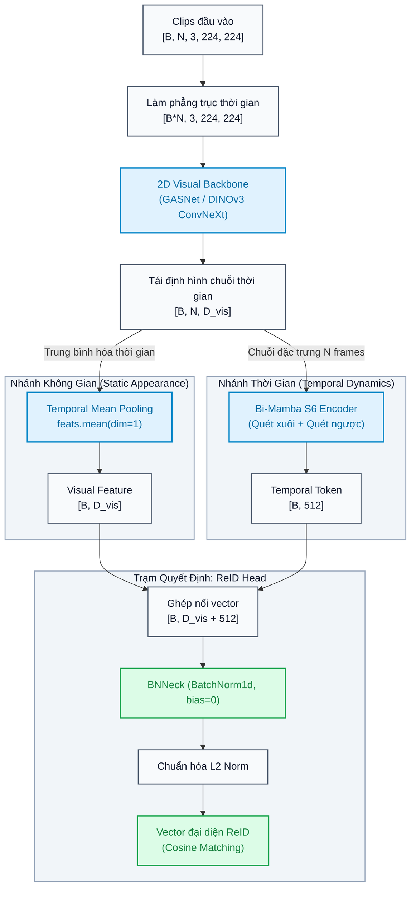
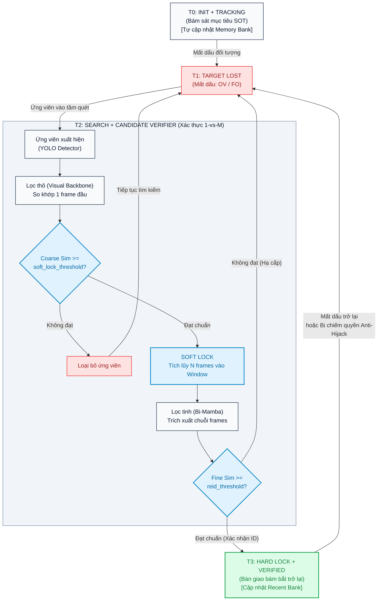

# BÁO CÁO TỔNG HỢP TOÀN DIỆN: HỆ THỐNG NHẬN DẠNG LẠI UAV (UAV RE-IDENTIFICATION)

| Thông tin tổng quan | Giá trị |
| :--- | :--- |
| **Dự án** | Hệ thống Giám sát & Bám bắt UAV Không Đối Không (UAV-Anti-UAV) |
| **Mô hình cốt lõi** | `UAVReIDNet` (GASNet / DINOv3 ConvNeXt + Bi-Mamba S6 + BNNeck) |
| **Môi trường thực nghiệm** | PyTorch 2.x, NVIDIA RTX 3050 (Local) / H100 Server |
| **Trạng thái tài liệu** | `Final Verified` (Đã chuẩn hóa theo Antigravity Report & Math Rules) |

> [!NOTE]
> **Tóm tắt điều hành (Executive Summary):**  
> Báo cáo này tổng hợp chi tiết bài toán nhận dạng lại UAV từ góc nhìn không đối không (*Air-to-Air ReID*) khi mục tiêu bị mất dấu (Out-of-View, Full Occlusion) và tái xuất hiện. Báo cáo làm rõ kiến trúc lai không - thời gian kết hợp giữa Visual Backbone và Bi-Mamba S6, quy trình xử lý end-to-end, giải quyết triệt để nút thắt suy luận ngày 14/9 (lệch độ dài token train/infer và co nén không gian Cosine của BNNeck), đồng thời thiết lập bộ chỉ số đánh giá khắt khe để đảm bảo khả năng bám bắt thời gian thực (> 43 FPS).

---

## 1. Bối cảnh & Bản chất bài toán

### 1.1. Định nghĩa bài toán & Kịch bản tác chiến
Bài toán kỹ thuật được định nghĩa là **Air-to-Air UAV Re-Identification under Out-of-View & Re-appearance Scenarios** (Nhận dạng lại máy bay không người lái từ góc nhìn không đối không khi bị mất dấu và tái xuất hiện).

```mermaid
flowchart LR
    %% Định nghĩa class tương phản an toàn Dark / Light mode
    classDef defaultNode fill:#f8fafc,stroke:#475569,stroke-width:1.5px,color:#0f172a;
    classDef highlightNode fill:#e0f2fe,stroke:#0284c7,stroke-width:2px,color:#0369a1;
    classDef alertNode fill:#fee2e2,stroke:#ef4444,stroke-width:1.5px,color:#991b1b;

    pursuer["Pursuer UAV<br/>(Camera theo dõi)"]:::defaultNode
    target["Target UAV<br/>(Mục tiêu gốc)"]:::highlightNode
    lost_event["Mất dấu (T1_LOST)<br/>OV hoặc FO"]:::alertNode
    reappear["Tái xuất hiện (T2_SEARCH)<br/>Nhiều ứng viên + Chim mồi"]:::defaultNode
    hard_lock["Khóa cứng mục tiêu cũ<br/>(HARD LOCK: T3_VERIFIED)"]:::highlightNode

    pursuer -->|"Bám sát liên tục"| target
    target -->|"Khuất tầm nhìn"| lost_event
    lost_event -->|"Tái xuất hiện"| reappear
    reappear -->|"ReID xác thực 1-vs-M"| hard_lock
```



<details>
<summary>📋 Bấm để xem / sao chép mã nguồn Mermaid thô (Sơ đồ Kịch bản)</summary>

```text
flowchart LR
    %% Định nghĩa class tương phản an toàn Dark / Light mode
    classDef defaultNode fill:#f8fafc,stroke:#475569,stroke-width:1.5px,color:#0f172a;
    classDef highlightNode fill:#e0f2fe,stroke:#0284c7,stroke-width:2px,color:#0369a1;
    classDef alertNode fill:#fee2e2,stroke:#ef4444,stroke-width:1.5px,color:#991b1b;

    pursuer["Pursuer UAV<br/>(Camera theo dõi)"]:::defaultNode
    target["Target UAV<br/>(Mục tiêu gốc)"]:::highlightNode
    lost_event["Mất dấu (T1_LOST)<br/>OV hoặc FO"]:::alertNode
    reappear["Tái xuất hiện (T2_SEARCH)<br/>Nhiều ứng viên + Chim mồi"]:::defaultNode
    hard_lock["Khóa cứng mục tiêu cũ<br/>(HARD LOCK: T3_VERIFIED)"]:::highlightNode

    pursuer -->|"Bám sát liên tục"| target
    target -->|"Khuất tầm nhìn"| lost_event
    lost_event -->|"Tái xuất hiện"| reappear
    reappear -->|"ReID xác thực 1-vs-M"| hard_lock
```
</details>

* **Kịch bản tác chiến thực tế:** Một UAV tuần tra/truy bám mang camera làm nhiệm vụ bám đuổi một UAV xâm nhập trong không gian 3 chiều.
* **Nguyên nhân mất dấu thường gặp:**
  * Bay ra khỏi trường nhìn của camera (Out-of-View - `OV`).
  * Bị che khuất hoàn toàn bởi địa vật hoặc mây mù (Full Occlusion - `FO`).
  * Cơ động chuyển hướng đột ngột gây mờ nhòe (Motion Blur) làm bộ phát hiện (YOLO/Object Detector) lỡ nhịp.
* **Thách thức khi tái xuất hiện:** Sau khoảng thời gian vắng mặt (ngắn < 5s hoặc dài > 15s), mục tiêu xuất hiện trở lại trong điều kiện:
  * Góc nhìn thay đổi lớn (Severe viewpoint variations).
  * Khoảng cách và kích thước thay đổi mạnh (vật thể có thể chiếm < 1% diện tích khung hình).
  * Xuất hiện đồng thời nhiều UAV gây nhiễu, chim mồi hoặc UAV lạ khác (Similar Distractors / Impostors).
* **Mục tiêu then chốt của ReID:** Phân biệt chính xác UAV mục tiêu ban đầu từ tập ứng viên, phát lệnh khóa cứng mục tiêu (Hard Lock) và bàn giao cho bộ theo dõi, ngăn chặn bám nhầm vào các drone khác.

### 1.2. Mối quan hệ giữa SOT và MOT
* **Pha bám bắt chính (SOT có cơ chế hồi phục):** Duy trì theo dõi 1 đối tượng duy nhất với tốc độ thời gian thực (> 30 FPS).
* **Pha xác thực trung gian (MOT 1-vs-M Verification):** Khi mục tiêu tái xuất hiện, hệ thống sàng lọc M ứng viên trong khung hình, so khớp toàn bộ ứng viên với kho ký ức (*Memory Bank*) để chốt lại đúng ID ban đầu.

---

## 2. Kiến trúc mô hình & Các module cốt lõi

Mô hình [UAVReIDNet](file:///c:/Users/admin/Developer/ViettelDev/UAVAntiUAV/model.py#L226) là một mạng lai không - thời gian (*Spatiotemporal ReID Network*) gồm 3 khối chức năng chính:



<details>
<summary>📋 Bấm để xem / sao chép mã nguồn Mermaid thô (Sơ đồ Kiến trúc Chuẩn xác)</summary>

```text
flowchart TD
    %% Thiết lập bảng màu tương phản an toàn cho cả Dark và Light Theme
    classDef defaultBlock fill:#f8fafc,stroke:#475569,stroke-width:1.5px,color:#0f172a;
    classDef highlightBlock fill:#e0f2fe,stroke:#0284c7,stroke-width:2px,color:#0369a1;
    classDef decisionBlock fill:#dcfce7,stroke:#16a34a,stroke-width:2px,color:#15803d;

    input_clips["Clips đầu vào<br/>[B, N, 3, 224, 224]"]:::defaultBlock
    flatten["Làm phẳng trục thời gian<br/>[B*N, 3, 224, 224]"]:::defaultBlock
    backbone["2D Visual Backbone<br/>(GASNet / DINOv3 ConvNeXt)"]:::highlightBlock
    reshape["Tái định hình chuỗi thời gian<br/>[B, N, D_vis]"]:::defaultBlock

    input_clips --> flatten --> backbone --> reshape

    %% Rẽ thành 2 nhánh từ tensor [B, N, D_vis]
    subgraph Stream1 ["Nhánh Không Gian (Static Appearance)"]
        direction TB
        mean_pool["Temporal Mean Pooling<br/>feats.mean(dim=1)"]:::highlightBlock
        visual_feat["Visual Feature<br/>[B, D_vis]"]:::defaultBlock
        mean_pool --> visual_feat
    end

    subgraph Stream2 ["Nhánh Thời Gian (Temporal Dynamics)"]
        direction TB
        bimamba["Bi-Mamba S6 Encoder<br/>(Quét xuôi + Quét ngược)"]:::highlightBlock
        temporal_token["Temporal Token<br/>[B, 512]"]:::defaultBlock
        bimamba --> temporal_token
    end

    %% Nối trục không gian sang cả 2 nhánh
    reshape -->|"Trung bình hóa thời gian"| mean_pool
    reshape -->|"Chuỗi đặc trưng N frames"| bimamba

    %% Hội tụ tại ReID Head
    subgraph Stream3 ["Trạm Quyết Định: ReID Head"]
        direction TB
        concat["Ghép nối vector<br/>[B, D_vis + 512]"]:::defaultBlock
        bn_neck["BNNeck (BatchNorm1d, bias=0)"]:::decisionBlock
        l2_norm["Chuẩn hóa L2 Norm"]:::defaultBlock
        final_rep["Vector đại diện ReID<br/>(Cosine Matching)"]:::decisionBlock
        concat --> bn_neck --> l2_norm --> final_rep
    end

    visual_feat --> concat
    temporal_token --> concat

    style Stream1 fill:#f1f5f9,stroke:#94a3b8,stroke-width:1.5px,color:#0f172a
    style Stream2 fill:#f1f5f9,stroke:#94a3b8,stroke-width:1.5px,color:#0f172a
    style Stream3 fill:#f1f5f9,stroke:#94a3b8,stroke-width:1.5px,color:#0f172a
```
</details>

### 2.1. Trục không gian (Visual Backbone)
1. **Phương án 1: GASNet (ResNet50-IBN + RGA + OSBlockFS + GeM):**
   * *IBN (Instance-Batch Normalization):* Tại Layer 1-3, một nửa số kênh đi qua Instance Norm nhằm triệt tiêu nhiễu môi trường, nửa còn lại qua Batch Norm giữ lại cấu trúc hình học. Layer 4 tắt IBN để bảo toàn đặc trưng định danh (Identity).
   * *RGA (Relation-Aware Global Attention):* Tính toán ma trận quan hệ không gian $49 \times 49$, liên kết các bộ phận cánh quạt và khung thân UAV, khuếch đại tín hiệu vật thể và loại bỏ nhiễu nền trời.
   * *OSBlockFS (Omni-Scale Feature Stream):* Rẽ 4 luồng tích chập sâu kết hợp Channel Gate để bắt nét UAV từ cự ly gần đến siêu xa.
   * *GeM Pooling ($p = 3.0$):* Khuếch đại tương phản giữa điểm sáng vật thể và nền trời phẳng, sinh vector visual 2560 chiều.
2. **Phương án 2: DINOv3 ConvNeXt-Small (Nâng cấp tối ưu):**
   * Mô hình nền tảng thị giác tự giám sát (*Vision Foundation Model*) từ Meta AI (FAIR).
   * Trích xuất đặc trưng visual 960 chiều, giảm độ trễ trích xuất (17.92 ms so với 23.69 ms của GASNet), nâng thông lượng toàn hệ thống lên 57.03 FPS.

### 2.2. Trục thời gian (Temporal Memory Engine: Bi-Mamba / S6)
* **Khối [SimpleS6Block](file:///c:/Users/admin/Developer/ViettelDev/UAVAntiUAV/model.py#L29):** Tự lập trình bằng phép toán ma trận song song (Parallel Cumsum) thuần PyTorch, loại bỏ hoàn toàn sự phụ thuộc vào thư viện CUDA C++ độc quyền `mamba_ssm`, giúp chạy mượt mà trên NVIDIA Jetson Orin và hỗ trợ đầy đủ `torch.compile`.
* **Cấu trúc Bi-Mamba:** Tách chuỗi thành nhánh xuôi và nhánh ngược. Khi UAV bị che khuất ngắt quãng, sự kết hợp giữa quá khứ và tương lai tua ngược giúp mạng **nội suy và bù đắp quỹ đạo bay**.
* **Hiệu năng:** Độ phức tạp tính toán tuyến tính $\mathcal{O}(N)$ theo chiều dài chuỗi frame; thời gian suy luận cực nhanh: chỉ từ 4.7 ms đến 8.5 ms cho chuỗi 16 frames.

### 2.3. Trạm định danh (ReID Head & BNNeck)
* Ghép nối vector visual ($D_{\text{vis}}$) và temporal (512 chiều) thành vector hợp nhất ($D_{\text{vis}} + 512$).
* **Cơ chế BNNeck (`BatchNorm1d`, bias = 0):**
  * Triplet Loss ép các vector cùng ID co lại trên mặt cầu $L_2$ (*Hypersphere*).
  * Cross-Entropy ID Loss đòi hỏi phân tách tuyến tính bằng siêu phẳng (*Hyperplane*).
  * BNNeck giải quyết mâu thuẫn này: Vector trước BN cấp cho Triplet Loss, vector sau BN cấp cho ID Classifier. Khi suy luận, vector sau BN được chuẩn hóa $L_2$ để tính độ tương đồng Cosine.

---

## 3. Quy trình xử lý toàn diện (End-to-End Pipeline)

### 3.1. Tiền xử lý dữ liệu (Data Pipeline)
* **Lấy mẫu ngắt quãng (Strided Sampling):** Lấy frame với bước nhảy `stride = 2` hoặc `3` nhằm loại bỏ dư thừa thông tin giữa các frame kề nhau, mở rộng phạm vi thời gian quan sát.
* **Căn chỉnh neo Anchor-First:**
  * Tập *Gallery* (ký ức trước khi mất dấu): Cố định frame cuối cùng ngay trước khi biến mất ($T_{\text{disappear}}$) làm neo, lấy $N-1$ frame ngắt quãng phía trước.
  * Tập *Query* (truy vấn khi tái xuất hiện): Cố định frame đầu tiên ngay khi xuất hiện lại ($T_{\text{reappear}}$) làm neo, lấy $N-1$ frame ngắt quãng phía sau.
* **Context-Enriched Cropping:** Mở rộng Bounding Box thêm `bbox_padding = 0.2` (20%) để giữ ngữ cảnh cánh quạt và khung viền.

### 3.2. Hàm mất mát đa nhiệm (Multi-Task Loss Formulation)

Thay vì dùng ảnh tĩnh chụp công thức, toàn bộ hàm mất mát của hệ thống được biểu diễn bằng chuẩn khối toán học KaTeX độc lập:

$$
\mathcal{L}_{\text{total}} = \mathcal{L}_{\text{ID}} + \lambda_1 \mathcal{L}_{\text{Triplet}} + \lambda_2 \mathcal{L}_{\text{Temporal}} + \lambda_3 \mathcal{L}_{\text{Center}}
$$

<details>
<summary>📋 Bấm để xem mã nguồn LaTeX của hàm mất mát tổng thể</summary>

```latex
\mathcal{L}_{\text{total}} = \mathcal{L}_{\text{ID}} + \lambda_1 \mathcal{L}_{\text{Triplet}} + \lambda_2 \mathcal{L}_{\text{Temporal}} + \lambda_3 \mathcal{L}_{\text{Center}}
```
</details>

**Ý nghĩa các thành phần mất mát:**
1. **$\mathcal{L}\_{\text{ID}}$ (Label-Smoothed Cross-Entropy Loss):** Hệ số làm mượt nhãn $\varepsilon = 0.1$ trên vector logits giúp ngăn ngừa hiện tượng overconfidence.
2. **$\mathcal{L}\_{\text{Triplet}}$ (Hard-Margin Triplet Loss):** Khai phá mẫu khó trực tuyến (*Online Hard Mining*) với margin $m = 0.3$ trên vector đã chuẩn hóa $L_2$.
3. **$\mathcal{L}\_{\text{Temporal}}$ (Temporal Consistency Loss):** Kiểm soát tính ổn định của chuỗi trạng thái ẩn $h_t$ trong Mamba giữa các frame liên tiếp:

$$
\mathcal{L}_{\text{Temporal}} = 1 - \frac{1}{N-1} \sum_{t=1}^{N-1} \text{CosineSim}(h_t, h_{t+1})
$$

<details>
<summary>📋 Bấm để xem mã nguồn LaTeX của Temporal Loss</summary>

```latex
\mathcal{L}_{\text{Temporal}} = 1 - \frac{1}{N-1} \sum_{t=1}^{N-1} \text{CosineSim}(h_t, h_{t+1})
```
</details>

4. **$\mathcal{L}\_{\text{Center}}$ (Center Loss):** Rút ngắn khoảng cách giữa vector đặc trưng từng frame về tâm cụm ID tương ứng để giảm phương sai nội bộ lớp.

### 3.3. Hậu xử lý & Máy trạng thái thời gian thực ([infer.py](file:///c:/Users/admin/Developer/ViettelDev/UAVAntiUAV/infer.py))



<details>
<summary>📋 Bấm để xem / sao chép mã nguồn Mermaid thô (Sơ đồ FSM & Pipeline)</summary>

```text
flowchart TD
    %% Thiết lập bảng màu tương phản an toàn cho cả Dark và Light Theme
    classDef stateNode fill:#f8fafc,stroke:#475569,stroke-width:1.5px,color:#0f172a;
    classDef decisionNode fill:#e0f2fe,stroke:#0284c7,stroke-width:2px,color:#0369a1;
    classDef alertNode fill:#fee2e2,stroke:#ef4444,stroke-width:1.5px,color:#991b1b;
    classDef verifiedNode fill:#dcfce7,stroke:#16a34a,stroke-width:2px,color:#15803d;

    t0_init["T0: INIT + TRACKING<br/>(Bám sát mục tiêu SOT)<br/>[Tự cập nhật Memory Bank]"]:::stateNode
    t1_lost["T1: TARGET LOST<br/>(Mất dấu: OV / FO)"]:::alertNode

    t0_init -->|"Mất dấu đối tượng"| t1_lost

    %% Subgraph quy trình tìm kiếm và xác thực 2 cấp
    subgraph T2_PIPELINE ["T2: SEARCH + CANDIDATE VERIFIER (Xác thực 1-vs-M)"]
        direction TB
        t2_entry["Ứng viên xuất hiện<br/>(YOLO Detector)"]:::stateNode
        coarse_filter["Lọc thô (Visual Backbone)<br/>So khớp 1 frame đầu"]:::stateNode
        coarse_check{"Coarse Sim >=<br/>soft_lock_threshold?"}:::decisionNode
        discard["Loại bỏ ứng viên"]:::alertNode
        soft_lock["SOFT LOCK<br/>Tích lũy N frames vào Window"]:::decisionNode
        fine_filter["Lọc tinh (Bi-Mamba)<br/>Trích xuất chuỗi frames"]:::stateNode
        fine_check{"Fine Sim >=<br/>reid_threshold?"}:::decisionNode

        t2_entry --> coarse_filter
        coarse_filter --> coarse_check
        coarse_check -->|"Không đạt"| discard
        coarse_check -->|"Đạt chuẩn"| soft_lock
        soft_lock --> fine_filter
        fine_filter --> fine_check
    end

    t1_lost -->|"Ứng viên vào tầm quét"| t2_entry
    discard -->|"Tiếp tục tìm kiếm"| t1_lost
    fine_check -->|"Không đạt (Hạ cấp)"| t1_lost

    t3_verified["T3: HARD LOCK + VERIFIED<br/>(Bàn giao bám bắt trở lại)<br/>[Cập nhật Recent Bank]"]:::verifiedNode

    fine_check -->|"Đạt chuẩn (Xác nhận ID)"| t3_verified

    %% Gộp 2 luồng chuyển tiếp cùng chiều để chống đè chữ
    t3_verified -->|"Mất dấu trở lại<br/>hoặc Bị chiếm quyền Anti-Hijack"| t1_lost

    style T2_PIPELINE fill:#f1f5f9,stroke:#94a3b8,stroke-width:1.5px,color:#0f172a
```
</details>

* **Ngân hàng ký ức 2 tầng (Two-Tier Memory Bank):**
  * *Anchor Bank (5 slots):* Lưu các vector đặc trưng ban đầu khi mục tiêu rõ nét nhất. Ký ức này là **bất biến** trong suốt chuỗi video.
  * *Recent Bank (15 slots):* Cập nhật trượt liên tục (FIFO) sau mỗi chu kỳ 2.0s để thích nghi với thay đổi góc nhìn và ánh sáng.
* **Cơ chế lọc 2 cấp Coarse-to-Fine:**
  1. *Lọc thô (Coarse Filter):* So khớp 1 frame đầu bằng Visual Backbone; nếu điểm $\ge \text{soft\_lock\_threshold}$ (0.30 - 0.50) $\rightarrow$ gán nhãn **SOFT LOCK**.
  2. *Lọc tinh (Fine Filter):* Gom đủ $N$ frame vào Sliding Window, kích hoạt Bi-Mamba sinh vector hoàn chỉnh. Nếu điểm $\ge \text{reid\_threshold}$ (0.75) $\rightarrow$ phát lệnh **HARD LOCK**.
  3. *Cơ chế chống chiếm quyền bám (Anti-Hijack):* Trong 5 chu kỳ đầu sau Hard Lock, liên tục đo độ tương đồng với Anchor Bank. Nếu điểm $< \text{hijack\_threshold}$ (0.40), lập tức hạ cấp về `T1_LOST` để tìm kiếm lại.

---

## 4. Bộ chỉ số đánh giá kỹ thuật

| Nhóm đánh giá | Chỉ số | Đơn vị | Định nghĩa & Ý nghĩa kỹ thuật |
| :--- | :--- | :---: | :--- |
| **Truy xuất (Retrieval)** | **Rank-1 / Rank-5** | % | Tỷ lệ truy vấn tìm thấy đúng mẫu ID ở vị trí top 1 hoặc trong top 5 ứng viên tương đồng nhất trong Gallery. |
| | **mAP** | % | Diện tích dưới đường cong Precision-Recall trung bình trên toàn bộ truy vấn. |
| | **mINP** | % | Mean Inverse Negative Penalty: đánh giá mức độ tìm thấy mẫu khó nhất (*Hardest Sample*). |
| **Xác thực & Kháng nhiễu** | **FAR** | % | False Accept Rate: tỷ lệ nhận nhầm kẻ mạo danh (chim mồi/drone lạ) thành mục tiêu. |
| | **FRR** | % | False Reject Rate: tỷ lệ từ chối nhầm mục tiêu thật khi tái xuất hiện. |
| | **TAR@FAR=0.1%** | % | True Accept Rate tại mức FAR cố định 0.1% (tiêu chuẩn khắt khe nhất). |
| | **Score Margin** | - | Khoảng cách an toàn $\text{Sim}\_{\text{Genuine}} - \text{Sim}\_{\text{Impostor}}$ (yêu cầu $> 0.4$). |
| **Thời gian thực** | **Throughput** | FPS | Tốc độ xử lý của cả pipeline trên luồng video (yêu cầu $> 30\text{ FPS}$). |
| | **Backbone Latency** | ms | Thời gian trích xuất CNN/ConvNeXt trên mỗi frame. |
| | **Mamba Latency** | ms | Thời gian chạy Mamba + ReID Head trên toàn bộ chuỗi $N$ frames. |

---

## 5. Kết quả thực nghiệm & Phân tích nút thắt cốt lõi

### 5.1. So sánh định lượng giữa các phương án Backbone

| Cấu trúc mạng | mAP (%) | Rank-1 (%) | Rank-5 (%) | Trích xuất CNN (ms) | Mamba+Head (ms) | Thông lượng (FPS) |
| :--- | :---: | :---: | :---: | :---: | :---: | :---: |
| GASNet (ResNet50-IBN) | 71.20 | 72.80 | 83.10 | 23.69 | **4.67** | 43.05 |
| **DINOv3 ConvNeXt-Small** | **74.15** | **74.56** | **85.36** | **17.92** | 4.70 | **57.03** |

> [!TIP]
> **Nhận xét:** Backbone DINOv3 ConvNeXt-Small vượt trội cả về độ chính xác (Rank-1 tăng +1.76%) lẫn tốc độ xử lý (thông lượng tăng từ 43.05 lên 57.03 FPS), tiết kiệm 5.77 ms trên mỗi frame xử lý.

---

### 5.2. Giải mã cuộc khủng hoảng ngày 14/9 & Đính chính gốc rễ ngày 15/9

> [!IMPORTANT]
> **Hiện tượng ngày 14/9:** Khi suy luận trên video thực tế, điểm visual đơn lẻ đạt rất cao (0.98), điểm temporal Mamba đạt mức trung bình (0.47 - 0.74), nhưng điểm Lọc tinh tổng hợp sau ReID Head lại tụt thảm hại xuống **0.04 - 0.51** $\rightarrow$ Hệ thống mất khả năng kích hoạt Hard Lock.

Qua đợt rà soát ngày 15/9, 4 nguyên nhân gốc rễ đã được xác định và khắc phục triệt để:

#### 1. Lệch số lượng Token giữa Huấn luyện và Suy luận (Nguyên nhân then chốt #1)
* **Phát hiện:** Cấu hình huấn luyện thiết lập `train.num_frames = 12` nhưng cấu hình suy luận lại để `infer.num_frames = 8`.
* **Cơ chế lỗi:** Do Mamba là mô hình chuỗi thời gian phụ thuộc trạng thái ẩn liên tục, việc chạy khác số token dẫn đến trôi lệch hoàn toàn phân phối vector đại diện.
* **Kết quả khắc phục:** Khi đồng bộ `num_frames = 12`, điểm Mamba nhảy vọt từ 0.52 lên **0.910 - 0.970 (trung bình 0.938)**, tương thích hoàn hảo với điểm visual (0.990).

#### 2. Bản chất hình học của BNNeck trong không gian Cosine
* Điểm vector thô trước BN (*Pre-BN*) đạt **0.953**, sau BN (*Post-BN*) đạt **0.734**.
* Mức suy giảm $\Delta = 0.218$ là một phép co nén tuyến tính có hệ thống ($r = -0.77$). Do đặt ngưỡng cứng $\text{reid\_threshold} = 0.75$, điểm 0.734 rơi ngay dưới ngưỡng chứ không phải do mô hình bị suy thoái khả năng phân biệt. Giải pháp là chuẩn hóa lại ngưỡng sau BN sang $0.70 - 0.72$ hoặc dùng trực tiếp vector Pre-BN cho phép đo Cosine.

#### 3. Nút thắt tràn bộ đệm Sliding Window (Nguyên nhân then chốt #2)
* Trong 8 lần UAV tái xuất hiện ở chuỗi `000059`, có tới **4 lần bị bỏ lỡ hoàn toàn** do UAV chỉ lướt qua trong 6 đến 10 frames rồi lại khuất bóng.
* Quy tắc cứng nhắc bắt buộc phải tích lũy đủ 12 frames liên tiếp khiến bộ đệm không kịp kích hoạt Bi-Mamba. Giải pháp là áp dụng cơ chế nội suy / padding động (dynamic padding/resampling) để có thể ra quyết định ngay từ frame thứ 6.

#### 4. Khắc phục việc nạp thiếu trọng số Checkpoint
* Lệnh `load_state_dict(strict=False)` trước đây âm thầm bỏ qua một số layer backbone bị lệch tên.
* Đã thay thế hoàn toàn bằng hàm [load_checkpoint_verbose()](file:///c:/Users/admin/Developer/ViettelDev/UAVAntiUAV/model.py#L380) có in bảng kiểm toán (Audit Table) chi tiết từng tensor trọng số khi nạp.

---

## 6. Kế hoạch hành động tiếp theo (Action Items)

- [ ] `[P0]` **Cấu hình động cho Sliding Window:** Triển khai cơ chế temporal padding / linear interpolation trong [infer.py](file:///c:/Users/admin/Developer/ViettelDev/UAVAntiUAV/infer.py) khi ứng viên xuất hiện dưới 12 frames.
- [ ] `[P0]` **Hiệu chỉnh ngưỡng Post-BN:** Cập nhật ngưỡng Hard Lock `reid_threshold` trong file cấu hình suy luận về mức 0.70 thay cho 0.75.
- [ ] `[P1]` **Tối ưu hóa TensorRT FP16:** Xuất mô hình DINOv3 ConvNeXt sang TensorRT engine để nâng tốc độ xử lý từ 57 FPS lên trên 80 FPS trên GPU biên.
- [ ] `[P2]` **Kiểm thử trên Anti-UAV-RGBT:** Chạy đánh giá độ bền vững (Robustness Benchmark) trên tập dữ liệu cặp kênh hồng ngoại nhiệt.
